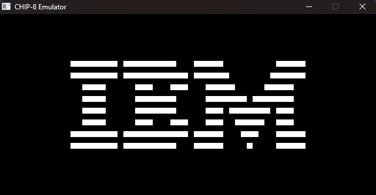

## Chip-8 Emulator 
A simple Chip-8 emulator that I am working on in order to better learn computer architecture. It is currently able to run all of the ROMS I have tested! There is some slight screen issues that arise with the Pong ROM but it functions as intended other than that.

